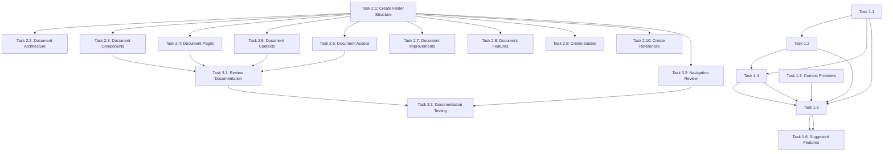

# Implementation Plan

## Overview

This document provides the implementation plan for the SimuTec Project Audit & Documentation project.

**Parent Specification:** requirements.md  
**Design:** design.md  
**Creation Date:** 2026-06-10  
**Feature Name:** simutec-audit

**Total Estimated Time:** 18.5 days

### Phases

- **Phase 1: Audit & Documentation** (Weeks 1-2) - 7 days, High Priority
- **Phase 2: Documentation Creation** (Weeks 2-3) - 9 days, High Priority
- **Phase 3: Review & Validation** (Weeks 3-4) - 2.5 days, High Priority

---

## Tasks

### Phase 1: Audit & Documentation (Weeks 1-2)

- [ ] 1.1 Complete Component Analysis
  - **ID:** TASK-001
  - **Estimated:** 1 day
  - **Priority:** High
  - **Dependencies:** None

  #### Description
  Perform comprehensive analysis of all components in `src/components/` and subdirectories. Document each component with its purpose, props, internal state, and relationships to other components.

  #### Technical Requirements
  - List all components in `src/components/` and subdirectories
  - Document props for each component (name, type, required, description)
  - Document internal state for each component
  - Identify reusable vs specific components

  #### Checklist
  - [ ] 1.1.1 List all components from `src/components/` (non-recursive)
  - [ ] 1.1.2 List components in `src/components/academic/`
  - [ ] 1.1.3 List components in `src/components/arduino/`
  - [ ] 1.1.4 List components in `src/components/kirchhoff/`
  - [ ] 1.1.5 List components in `src/components/math/`
  - [ ] 1.1.6 List components in `src/components/norton/`
  - [ ] 1.1.7 List components in `src/components/resistor/`
  - [ ] 1.1.8 List components in `src/components/series-parallel/`
  - [ ] 1.1.9 List components in `src/components/thevenin/`
  - [ ] 1.1.10 List components in `src/components/units/`
  - [ ] 1.1.11 List components in `src/components/user/`
  - [ ] 1.1.12 List components in `src/components/workshop/`
  - [ ] 1.1.13 Document props for each component
  - [ ] 1.1.14 Document internal state for each component
  - [ ] 1.1.15 Identify dependencies between components
  - [ ] 1.1.16 Identify 5+ potentially reusable components

  #### Completion Criteria
  - [ ] 1.1.17 All components listed in requirements.md components section
  - [ ] 1.1.18 Props documented for all components
  - [ ] 1.1.19 Component dependencies mapped
  - [ ] 1.1.20 5+ reusable components identified

- [ ] 1.2 Page and Route Analysis
  - **ID:** TASK-002
  - **Estimated:** 1 day
  - **Priority:** High
  - **Dependencies:** TASK-001

  #### Description
  Analyze all routes in `App.jsx` and document each page with its purpose, components used, required permissions, and API endpoints.

  #### Technical Requirements
  - List all routes in `App.jsx`
  - Document components used in each page
  - Document required permissions/roles
  - Document API endpoints used
  - Identify protected vs public routes

  #### Checklist
  - [ ] 1.2.1 List all public routes
  - [ ] 1.2.2 List all protected routes
  - [ ] 1.2.3 Document components used in each page
  - [ ] 1.2.4 Document permissions/roles for protected routes
  - [ ] 1.2.5 Identify API endpoints used
  - [ ] 1.2.6 Identify undocumented routes

  #### Completion Criteria
  - [ ] 1.2.11 All routes documented in requirements.md pages section
  - [ ] 1.2.12 Permissions documented for protected routes
  - [ ] 1.2.13 Components used listed per page
  - [ ] 1.2.14 API endpoints identified

- [ ] 1.3 Context Providers Analysis
  - **ID:** TASK-003
  - **Estimated:** 0.5 day
  - **Priority:** High
  - **Dependencies:** None

  #### Description
  Analyze all context providers (`AuthContext`, `ThemeContext`) and document their structure, methods, and states.

  #### Technical Requirements
  - Document AuthContext
  - Document ThemeContext
  - Identify usage patterns
  - Document public methods

  #### Checklist
  - [ ] 1.3.1 Document AuthContext completely
  - [ ] 1.3.2 Document ThemeContext completely
  - [ ] 1.3.3 Identify usage patterns
  - [ ] 1.3.4 Document public methods

  #### Completion Criteria
  - [ ] 1.3.8 AuthContext documented
  - [ ] 1.3.9 ThemeContext documented
  - [ ] 1.3.10 Usage patterns identified

- [ ] 1.4 Access Systems Analysis
  - **ID:** TASK-004
  - **Estimated:** 0.5 day
  - **Priority:** Medium
  - **Dependencies:** TASK-001, TASK-002

  #### Description
  Analyze protected access systems (UtnAccessGate, MobileAccessGate) and document their implementation.

  #### Technical Requirements
  - Document UtnAccessGate
  - Document MobileAccessGate
  - Identify usage patterns
  - Document public methods

  #### Checklist
  - [ ] 1.4.1 Document UtnAccessGate completely
  - [ ] 1.4.2 Document MobileAccessGate completely
  - [ ] 1.4.3 Identify usage patterns
  - [ ] 1.4.4 Document public methods

  #### Completion Criteria
  - [ ] 1.4.9 UtnAccessGate documented
  - [ ] 1.4.10 MobileAccessGate documented
  - [ ] 1.4.11 Keywords documented
  - [ ] 1.4.12 Events documented

- [ ] 1.5 Technical Improvements Documentation
  - **ID:** TASK-005
  - **Estimated:** 1 day
  - **Priority:** Medium
  - **Dependencies:** TASK-001, TASK-002, TASK-003, TASK-004

  #### Description
  Document all identified technical improvements with implementation details.

  #### Technical Requirements
  - Document improvement 1: State Management
  - Document improvement 2: Reusable Components
  - Document improvement 3: Error Handling
  - Document improvement 4: Performance
  - Document improvement 5: Accessibility
  - Document improvement 6: CSS/Styles
  - Document improvement 7: Testing
  - Document improvement 8: Component Documentation

  #### Checklist
  - [ ] 1.5.1 Document improvement 1: State Management
  - [ ] 1.5.2 Document improvement 2: Reusable Components
  - [ ] 1.5.3 Document improvement 3: Error Handling
  - [ ] 1.5.4 Document improvement 4: Performance
  - [ ] 1.5.5 Document improvement 5: Accessibility
  - [ ] 1.5.6 Document improvement 6: CSS/Styles
  - [ ] 1.5.7 Document improvement 7: Testing
  - [ ] 1.5.8 Document improvement 8: Component Documentation
  - [ ] 1.5.9 Assign priority to each improvement
  - [ ] 1.5.10 Estimate time for each improvement

  #### Completion Criteria
  - [ ] 1.5.14 All improvements documented
  - [ ] 1.5.15 Priorities assigned
  - [ ] 1.5.16 Time estimations complete

- [ ] 1.6 Suggested Features Documentation
  - **ID:** TASK-006
  - **Estimated:** 1 day
  - **Priority:** Medium
  - **Dependencies:** TASK-005

  #### Description
  Document all suggested features with implementation details.

  #### Technical Requirements
  - Document feature 1: Centralized Notifications
  - Document feature 2: Offline Mode
  - Document feature 3: Content Export
  - Document feature 4: Progress Dashboard
  - Document feature 5: Collaborative Projects
  - Document feature 6: LMS Integration
  - Document feature 7: 3D Simulators
  - Document feature 8: Support Chatbot
  - Document feature 9: Educational Analytics

  #### Checklist
  - [ ] 1.6.1 Document feature 1: Centralized Notifications
  - [ ] 1.6.2 Document feature 2: Offline Mode
  - [ ] 1.6.3 Document feature 3: Content Export
  - [ ] 1.6.4 Document feature 4: Progress Dashboard
  - [ ] 1.6.5 Document feature 5: Collaborative Projects
  - [ ] 1.6.6 Document feature 6: LMS Integration
  - [ ] 1.6.7 Document feature 7: 3D Simulators
  - [ ] 1.6.8 Document feature 8: Support Chatbot
  - [ ] 1.6.9 Document feature 9: Educational Analytics
  - [ ] 1.6.10 Assign priority to each feature
  - [ ] 1.6.11 Estimate time for each feature

  #### Completion Criteria
  - [ ] 1.6.15 All features documented
  - [ ] 1.6.16 Priorities assigned
  - [ ] 1.6.17 Time estimations complete

---

### Phase 2: Documentation Creation (Weeks 2-3)

- [ ] 2.1 Create Folder Structure
  - **ID:** TASK-007
  - **Estimated:** 0.5 day
  - **Priority:** High
  - **Dependencies:** None

  #### Description
  Create the folder structure for documentation in `docs/`.

  #### Technical Requirements
  - Create directories per design.md
  - Create index files for each section
  - Configure main README.md

  #### Checklist
  - [ ] 2.1.1 Create `docs/audit/`
  - [ ] 2.1.2 Create `docs/audit/current-state/`
  - [ ] 2.1.3 Create `docs/audit/current-state/components/`
  - [ ] 2.1.4 Create `docs/audit/current-state/pages/`
  - [ ] 2.1.5 Create `docs/audit/improvements/`
  - [ ] 2.1.6 Create `docs/specs/`
  - [ ] 2.1.7 Create `docs/guides/`
  - [ ] 2.1.8 Create `docs/references/`
  - [ ] 2.1.9 Create `docs/audit/current-state/api.md`
  - [ ] 2.1.10 Create `docs/specs/README.md`
  - [ ] 2.1.11 Create `docs/guides/README.md`
  - [ ] 2.1.12 Create `docs/references/README.md`
  - [ ] 2.1.13 Create `docs/README.md`

  #### Completion Criteria
  - [ ] 2.1.17 All directories created
  - [ ] 2.1.18 All index files created
  - [ ] 2.1.19 Main README.md configured

- [ ] 2.2 Document Technical Architecture
  - **ID:** TASK-008
  - **Estimated:** 1 day
  - **Priority:** High
  - **Dependencies:** TASK-007

  #### Description
  Create technical architecture documentation in `docs/audit/current-state/architecture.md`.

  #### Technical Requirements
  - Document technology stack
  - Document directory structure
  - Document design patterns
  - Document data flows

  #### Checklist
  - [ ] 2.2.1 Document technology stack
  - [ ] 2.2.2 Document directory structure
  - [ ] 2.2.3 Document design patterns
  - [ ] 2.2.4 Document data flows
  - [ ] 2.2.5 Add diagrams (if applicable)

  #### Completion Criteria
  - [ ] 2.2.8 Architecture documentation complete
  - [ ] 2.2.9 Diagrams included (if applicable)

- [ ] 2.3 Document Components
  - **ID:** TASK-009
  - **Estimated:** 2 days
  - **Priority:** High
  - **Dependencies:** TASK-001, TASK-007

  #### Description
  Create detailed component documentation in `docs/audit/current-state/components/`.

  #### Technical Requirements
  - Document main components
  - Document module-specific components
  - Document academic management components
  - Use component template from design.md

  #### Checklist
  - [ ] 2.3.1 Document main components (NavBar, Footer, ThemeContext, ProtectedRoute, etc.)
  - [ ] 2.3.2 Document Arduino components
  - [ ] 2.3.3 Document math components
  - [ ] 2.3.4 Document physics components
  - [ ] 2.3.5 Document academic components
  - [ ] 2.3.6 Use component template
  - [ ] 2.3.7 Include usage examples

  #### Completion Criteria
  - [ ] 2.3.11 All components documented
  - [ ] 2.3.12 Template applied consistently
  - [ ] 2.3.13 Usage examples included

- [ ] 2.4 Document Pages
  - **ID:** TASK-010
  - **Estimated:** 1.5 days
  - **Priority:** High
  - **Dependencies:** TASK-002, TASK-007

  #### Description
  Create detailed page documentation in `docs/audit/current-state/pages/`.

  #### Technical Requirements
  - Document public pages
  - Document protected pages
  - Document academic management pages
  - Use page template from design.md

  #### Checklist
  - [ ] 2.4.1 Document public pages (Home, OhmLawPage, etc.)
  - [ ] 2.4.2 Document Arduino pages
  - [ ] 2.4.3 Document math pages
  - [ ] 2.4.4 Document physics pages
  - [ ] 2.4.5 Document technical drawing pages
  - [ ] 2.4.6 Document digital electronics pages
  - [ ] 2.4.7 Document computing fundamentals pages
  - [ ] 2.4.8 Document academic management pages
  - [ ] 2.4.9 Use page template
  - [ ] 2.4.10 Include usage examples

  #### Completion Criteria
  - [ ] 2.4.14 All pages documented
  - [ ] 2.4.15 Template applied consistently
  - [ ] 2.4.16 Usage examples included

- [ ] 2.5 Document Context Providers
  - **ID:** TASK-011
  - **Estimated:** 0.5 day
  - **Priority:** High
  - **Dependencies:** TASK-003, TASK-007

  #### Description
  Create documentation for AuthContext and ThemeContext.

  #### Technical Requirements
  - Document AuthContext
  - Document ThemeContext
  - Include usage examples

  #### Checklist
  - [ ] 2.5.1 Document AuthContext
  - [ ] 2.5.2 Document ThemeContext
  - [ ] 2.5.3 Include usage examples

  #### Completion Criteria
  - [ ] 2.5.7 AuthContext documented
  - [ ] 2.5.8 ThemeContext documented
  - [ ] 2.5.9 Usage examples included

- [ ] 2.6 Document Access Systems
  - **ID:** TASK-012
  - **Estimated:** 0.5 day
  - **Priority:** Medium
  - **Dependencies:** TASK-004, TASK-007

  #### Description
  Create documentation for UtnAccessGate and MobileAccessGate.

  #### Technical Requirements
  - Document UtnAccessGate
  - Document MobileAccessGate
  - Include usage examples

  #### Checklist
  - [ ] 2.6.1 Document UtnAccessGate
  - [ ] 2.6.2 Document MobileAccessGate
  - [ ] 2.6.3 Include usage examples

  #### Completion Criteria
  - [ ] 2.6.7 UtnAccessGate documented
  - [ ] 2.6.8 MobileAccessGate documented
  - [ ] 2.6.9 Usage examples included

- [ ] 2.7 Document Technical Improvements
  - **ID:** TASK-013
  - **Estimated:** 1 day
  - **Priority:** Medium
  - **Dependencies:** TASK-005, TASK-007

  #### Description
  Create technical improvements documentation in `docs/audit/improvements/technical.md`.

  #### Technical Requirements
  - Document improvement 1: State Management
  - Document improvement 2: Reusable Components
  - Document improvement 3: Error Handling
  - Document improvement 4: Performance
  - Document improvement 5: Accessibility
  - Document improvement 6: CSS/Styles
  - Document improvement 7: Testing
  - Document improvement 8: Component Documentation

  #### Checklist
  - [ ] 2.7.1 Document improvement 1: State Management
  - [ ] 2.7.2 Document improvement 2: Reusable Components
  - [ ] 2.7.3 Document improvement 3: Error Handling
  - [ ] 2.7.4 Document improvement 4: Performance
  - [ ] 2.7.5 Document improvement 5: Accessibility
  - [ ] 2.7.6 Document improvement 6: CSS/Styles
  - [ ] 2.7.7 Document improvement 7: Testing
  - [ ] 2.7.8 Document improvement 8: Component Documentation

  #### Completion Criteria
  - [ ] 2.7.12 All improvements documented
  - [ ] 2.7.13 Implementation plan included
  - [ ] 2.7.14 Priorities and estimations included

- [ ] 2.8 Document Suggested Features
  - **ID:** TASK-014
  - **Estimated:** 1 day
  - **Priority:** Medium
  - **Dependencies:** TASK-006, TASK-007

  #### Description
  Create suggested features documentation in `docs/audit/improvements/features.md`.

  #### Technical Requirements
  - Document feature 1: Centralized Notifications
  - Document feature 2: Offline Mode
  - Document feature 3: Content Export
  - Document feature 4: Progress Dashboard
  - Document feature 5: Collaborative Projects
  - Document feature 6: LMS Integration
  - Document feature 7: 3D Simulators
  - Document feature 8: Support Chatbot
  - Document feature 9: Educational Analytics

  #### Checklist
  - [ ] 2.8.1 Document feature 1: Centralized Notifications
  - [ ] 2.8.2 Document feature 2: Offline Mode
  - [ ] 2.8.3 Document feature 3: Content Export
  - [ ] 2.8.4 Document feature 4: Progress Dashboard
  - [ ] 2.8.5 Document feature 5: Collaborative Projects
  - [ ] 2.8.6 Document feature 6: LMS Integration
  - [ ] 2.8.7 Document feature 7: 3D Simulators
  - [ ] 2.8.8 Document feature 8: Support Chatbot
  - [ ] 2.8.9 Document feature 9: Educational Analytics

  #### Completion Criteria
  - [ ] 2.8.13 All features documented
  - [ ] 2.8.14 Implementation plan included
  - [ ] 2.8.15 Priorities and estimations included

- [ ] 2.9 Create Developer Guides
  - **ID:** TASK-015
  - **Estimated:** 1.5 days
  - **Priority:** High
  - **Dependencies:** TASK-007

  #### Description
  Create developer guides in `docs/guides/`.

  #### Technical Requirements
  - Create getting-started.md
  - Create coding-standards.md
  - Create testing-guide.md
  - Create deployment.md

  #### Checklist
  - [ ] 2.9.1 Create `docs/guides/getting-started.md`
  - [ ] 2.9.2 Create `docs/guides/coding-standards.md`
  - [ ] 2.9.3 Create `docs/guides/testing-guide.md`
  - [ ] 2.9.4 Create `docs/guides/deployment.md`

  #### Completion Criteria
  - [ ] 2.9.8 All guides created
  - [ ] 2.9.9 Guides complete and useful
  - [ ] 2.9.10 Examples included

- [ ] 2.10 Create Technical References
  - **ID:** TASK-016
  - **Estimated:** 1 day
  - **Priority:** Medium
  - **Dependencies:** TASK-007

  #### Description
  Create technical references in `docs/references/`.

  #### Technical Requirements
  - Create glossary.md
  - Create quick-reference.md
  - Include useful links

  #### Checklist
  - [ ] 2.10.1 Create `docs/references/glossary.md`
  - [ ] 2.10.2 Create `docs/references/quick-reference.md`
  - [ ] 2.10.3 Include useful links (React, Vite, etc.)

  #### Completion Criteria
  - [ ] 2.10.7 Glossary complete
  - [ ] 2.10.8 Quick reference complete
  - [ ] 2.10.9 Useful links included

---

### Phase 3: Review & Validation (Weeks 3-4)

- [ ] 3.1 Technical Documentation Review
  - **ID:** TASK-017
  - **Estimated:** 1 day
  - **Priority:** High
  - **Dependencies:** TASK-009, TASK-010, TASK-011, TASK-012

  #### Description
  Review all technical documentation by a senior developer.

  #### Technical Requirements
  - Review component documentation
  - Review page documentation
  - Review context documentation
  - Verify technical accuracy

  #### Checklist
  - [ ] 3.1.1 Review component documentation
  - [ ] 3.1.2 Review page documentation
  - [ ] 3.1.3 Review context documentation
  - [ ] 3.1.4 Verify technical accuracy
  - [ ] 3.1.5 Fix errors found

  #### Completion Criteria
  - [ ] 3.1.10 Documentation reviewed by senior developer
  - [ ] 3.1.11 Errors fixed
  - [ ] 3.1.12 Consistency verified

- [ ] 3.2 Navigation and Structure Review
  - **ID:** TASK-018
  - **Estimated:** 0.5 day
  - **Priority:** Medium
  - **Dependencies:** TASK-007

  #### Description
  Review documentation navigation and structure.

  #### Technical Requirements
  - Verify logical navigation
  - Verify links between documents
  - Verify format consistency

  #### Checklist
  - [ ] 3.2.1 Verify logical navigation
  - [ ] 3.2.2 Verify links between documents
  - [ ] 3.2.3 Verify format consistency
  - [ ] 3.2.4 Fix errors found

  #### Completion Criteria
  - [ ] 3.2.8 Navigation reviewed
  - [ ] 3.2.9 Links working
  - [ ] 3.2.10 Format consistent
  - [ ] 3.2.11 Errors fixed

- [ ] 3.3 Documentation Testing
  - **ID:** TASK-019
  - **Estimated:** 1 day
  - **Priority:** High
  - **Dependencies:** TASK-017, TASK-018

  #### Description
  Perform documentation testing with new developers.

  #### Technical Requirements
  - Select developers for testing
  - Provide getting started guides
  - Receive feedback
  - Document issues found

  #### Checklist
  - [ ] 3.3.1 Select developers for testing
  - [ ] 3.3.2 Provide getting started guides
  - [ ] 3.3.3 Receive feedback
  - [ ] 3.3.4 Document issues found
  - [ ] 3.3.5 Fix issues found

  #### Completion Criteria
  - [ ] 3.3.10 Testing completed
  - [ ] 3.3.11 Feedback documented
  - [ ] 3.3.12 Issues fixed
  - [ ] 3.3.13 Documentation validated by real users

---

## Task Dependency Graph

### Mermaid Flowchart



### JSON DAG (Directed Acyclic Graph)

```json
{
  "nodes": [
    {"id": "1.1", "title": "Complete Component Analysis", "wave": 0},
    {"id": "1.2", "title": "Page and Route Analysis", "wave": 0},
    {"id": "1.3", "title": "Context Providers Analysis", "wave": 0},
    {"id": "1.4", "title": "Access Systems Analysis", "wave": 0},
    {"id": "1.5", "title": "Technical Improvements Documentation", "wave": 0},
    {"id": "1.6", "title": "Suggested Features Documentation", "wave": 0},
    {"id": "2.1", "title": "Create Folder Structure", "wave": 1},
    {"id": "2.2", "title": "Document Technical Architecture", "wave": 1},
    {"id": "2.3", "title": "Document Components", "wave": 1},
    {"id": "2.4", "title": "Document Pages", "wave": 1},
    {"id": "2.5", "title": "Document Context Providers", "wave": 1},
    {"id": "2.6", "title": "Document Access Systems", "wave": 1},
    {"id": "2.7", "title": "Document Technical Improvements", "wave": 1},
    {"id": "2.8", "title": "Document Suggested Features", "wave": 1},
    {"id": "2.9", "title": "Create Developer Guides", "wave": 1},
    {"id": "2.10", "title": "Create Technical References", "wave": 1},
    {"id": "3.1", "title": "Technical Documentation Review", "wave": 2},
    {"id": "3.2", "title": "Navigation and Structure Review", "wave": 2},
    {"id": "3.3", "title": "Documentation Testing", "wave": 2}
  ],
  "edges": [
    {"from": "1.1", "to": "1.2"},
    {"from": "1.1", "to": "1.4"},
    {"from": "1.1", "to": "1.5"},
    {"from": "1.2", "to": "1.4"},
    {"from": "1.2", "to": "1.5"},
    {"from": "1.3", "to": "1.5"},
    {"from": "1.4", "to": "1.5"},
    {"from": "1.5", "to": "1.6"},
    {"from": "1.5", "to": "2.7"},
    {"from": "1.6", "to": "2.8"},
    {"from": "2.1", "to": "2.2"},
    {"from": "2.1", "to": "2.3"},
    {"from": "2.1", "to": "2.4"},
    {"from": "2.1", "to": "2.5"},
    {"from": "2.1", "to": "2.6"},
    {"from": "2.1", "to": "2.7"},
    {"from": "2.1", "to": "2.8"},
    {"from": "2.1", "to": "2.9"},
    {"from": "2.1", "to": "2.10"},
    {"from": "2.3", "to": "3.1"},
    {"from": "2.4", "to": "3.1"},
    {"from": "2.5", "to": "3.1"},
    {"from": "2.6", "to": "3.1"},
    {"from": "2.1", "to": "3.2"},
    {"from": "3.1", "to": "3.3"},
    {"from": "3.2", "to": "3.3"}
  ],
  "waves": [
    {
      "id": 0,
      "title": "Audit Phase",
      "description": "Analysis and documentation of existing system",
      "tasks": ["1.1", "1.2", "1.3", "1.4", "1.5", "1.6"]
    },
    {
      "id": 1,
      "title": "Documentation Creation Phase",
      "description": "Creating comprehensive documentation",
      "tasks": ["2.1", "2.2", "2.3", "2.4", "2.5", "2.6", "2.7", "2.8", "2.9", "2.10"]
    },
    {
      "id": 2,
      "title": "Review & Validation Phase",
      "description": "Review and testing of documentation",
      "tasks": ["3.1", "3.2", "3.3"]
    }
  ],
  "criticalPath": ["1.1", "1.2", "1.5", "2.1", "2.3", "3.1", "3.3"],
  "totalWaves": 3
}
```

---

## Notes

### Considerations
- Documentation must be kept up to date
- Consider automating parts of documentation
- Implement CI to verify documentation doesn't become outdated

### Risks
- Risk of outdated documentation if not maintained
- Risk of workload overload if trying to document everything

### Assumptions
- Development team has full access to code
- Developers have knowledge of the technology stack
- No significant architecture changes during documentation

---

**Status:** Draft  
**Next Review:** After completing tasks.md  
**Last Updated:** 2026-06-10
